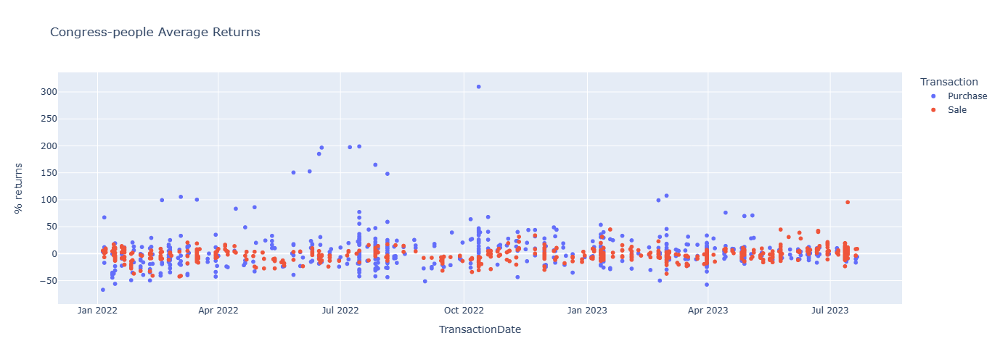
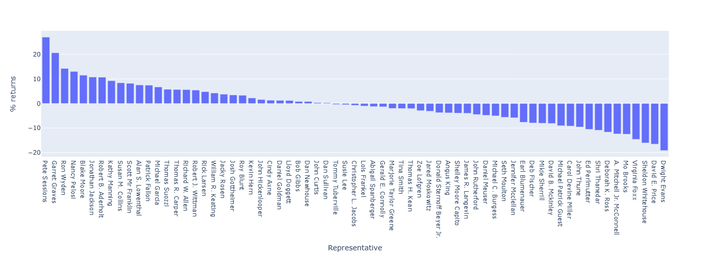
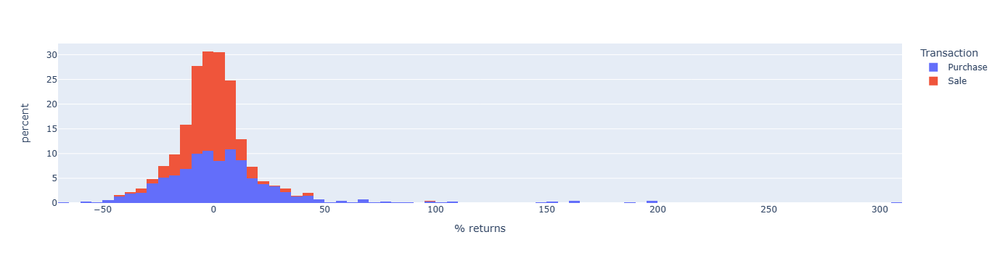

# project_3_congress_insider
---
# Two Face Assets
Our objective was to analyze the asset trades of US members of Congress and determine if we could predict whether their trades would yield positive returns based on their transactions, assets traded, and their party affiliations. We extracted, cleaned, merged, and preprocessed the data to feed into a Machine Learning model. The goal is to predict if a political party, on average, will return a positive or negative return based on their stock purchases or sales.

## Data Sources
- [Quiver Quantitative's Congressional Trading API](https://www.quiverquant.com/)
- [Yahoo Finance](https://finance.yahoo.com/) (via the `yfinance` Python library)
- [UnitedStates.io](https://www.unitedstates.io/)

## Project Objective
Many of our leaders don't take office as wealthy citizens, but those who serve long enough leave office a bit closer than that one percent. Elected officials have capitalized on insider knowledge, so it stands to reason that they can and likely are still doing so. We sought to find out if their trades are still profitable and if we can turn a profit trading the same way they do. Using data from the above sources, we cleaned, merged, and preprocessed the data for our Machine Learning model. Our goal is to find out if political party, committee membership, and time in office are factors in their stock purchases or sales. We want to know if their returns are positive or negative on average.

## Data Cleaning and ETL
The two APIs we used to gather our quantitative data, Yahoo Finance and Quiver, allowed us to import (2) data frames to clean and process as our raw data. 
 Yahoo gave us a data frame that gave the open, high, low, close, and adjusted close prices. The volume of our 691 stock tickers over 3 years, and Quiver gave us a data frame of congressman's transactions, the stocks they traded, and the dates that the transactions occurred and were reported. Using the Python libraries pandas, numpy, and datetime, we performed a series of merges, filters, and calculations to create a final data frame that combined raw data sources to give us the financial information (tickers, prices, returns) per transaction per representative. This final dataframe was used as the basis for our machine learning model and streamlit UI.

The streamlit UI also gathered legislative data from the UnitedStates.io API to provide background data about the representative chosen by the user. The raw data was imported in JSON format and had to be parsed and transformed into dataframes to be applicable and presentable on the streamlit UI.

## Machine Learning and Results

### Understanding the data
Before modeling could begin, we created some summary statistics to understand the data. Initially, our data from our congress dataframe was:

* Sale        15681
* Purchase    14978
* Exchange      161
* Exercise       19

However, after cleaning the data, our final counts were as follows:
* Sale        820
* Purchase    621

We chose to eliminate the Exchange and Exercise transactions since they were few and because they would have further complicated our analysis. 

Our final results had 67 congressmen with a total average return of < 1%. The figure below illustrates the average returns by each member of Congress.



We were also surprised that, given our assumptions on the asset prices, the distribution of returns from our members of Congress was less than expected except for some very high outliers.

The image below illustrates the distribution of the returns:



Finally, we were again surprised by the imbalance of our data. We had significantly more sale data than purchase data:



Our best step forward was first to create a classifier model. We created a model where our objective function was positive vs. negative returns. We hypothesized that if we know all of the attributes of the congresspeople and the transactions they made, we can create a model that can predict positive and negative returns based on the congressperson's profile. Therefore, our model function was:

* Y = 1 returns > 0 and y =  0 if returns < 0
* X = [Ticker, Party, Transaction, House]

We used several models to gain insights into how accurately we can predict the returns. 

For our TensorFlow model:

**Loss:** The loss function value is 1.1659. This metric indicates how well the model's predictions align with the true labels. A lower value is better, suggesting that the model's predictions are closer to the true outcomes. It's worth noting that the absolute value of the loss depends on the specific loss function used (e.g., binary cross-entropy, mean squared error). Here, a loss of 1.1659 indicates room for improvement, as in many classification tasks, especially with neural networks, we aim for a much lower loss value.

**Accuracy:** The model's accuracy on the test set is approximately 63.99%. This metric reveals that, of all predictions made by the model, around 64% were correct. While this is better than random guessing (which would be 50% for a binary classification task), it's essential to consider the problem's context. For some applications, 64% might be an acceptable accuracy, while higher accuracy might be required for others, especially in critical areas like medical diagnosis or finance.

In conclusion, while the TensorFlow model offers a moderate level of accuracy, there might be potential benefits from further tuning or using more complex architectures, additional features, or more data to improve performance.

## Conclusion:
Throughout our project, we employed several machine learning algorithms to assess the predictability of whether stock trades by congressmen would be profitable. Here's a summary of our findings:

**DecisionTreeClassifier:**
* Accuracy: 82%
* Precision for class 0 and 1: 80% and 85%, respectively.
* Recall for class 0 and 1: 86% and 78%, respectively.
This model performed relatively well, correctly predicting the outcomes 82% of the time. Strong precision and recall figures indicate a balanced performance across both classes.

**AdaBoost:**
* Accuracy: 66%
* Precision for class 0 and 1: 62% and 77%, respectively.
* Recall for class 0 and 1: 87% and 44%, respectively.
The AdaBoost model had a lower accuracy, with a noticeable disparity between precision and recall for class 1. This result suggests the model might predict fewer true positives for class 1, leaving room for improvement.

**SVM (Support Vector Machine):**
* Accuracy: 76%
* Precision for class 0 and 1: 74% and 79%, respectively.
* Recall for class 0 and 1: 81% and 71%, respectively.
The SVM model presented a more balanced outcome than AdaBoost, with a respectable accuracy of 76%. Both precision and recall are consistent across classes, suggesting an even representation of the model's predictions.

**TensorFlow Neural Network:**
* Loss: 1.1659
* Accuracy: 63.99%
The TensorFlow model had an accuracy just shy of 64%. While it offers a moderate level of accuracy, there's potential for enhancement through further tuning or architectural adjustments.

In light of our findings, the DecisionTreeClassifier is the most promising model in predicting stock trade profitability for congressmen based on our dataset and features. However, every model has its strengths and areas of potential enhancement. The disparity in results underscores the importance of experimenting with various algorithms, especially in real-world scenarios where the data might not be linearly separable or may possess underlying patterns that some models capture better than others.
Future steps could involve:
Refining these models further.
Incorporating additional features.
Gathering more data.
Exploring more advanced machine learning techniques.
Additionally, understanding the context and real-world implications of these predictions is crucial. It's not just about achieving high accuracy; it's about extracting meaningful insights to drive decision-making.

## Assumptions and Limitations

### Assumptions:
1. For the Sale Transactions in the Quiver API, since we lack data on when the assets were purchased, we matched the sale transaction date and ticker with the ticker price 30 days prior using `yfinance,` considering congressmen must hold assets for a minimum of 30 days.
2. Our analysis focuses on the timeframe from 2022 onward, bearing in mind the recent congressional elections.
3. During backtesting, we limited our scope to a timeframe the machine learning model was familiar with to avoid introducing unknown factors.

### Limitations:
1. Some stocks were inaccessible due to being delisted, renamed, or no longer traded. We adjusted our dataset to reflect these changes.
2. The "Purchase" and "Sale" transaction types were imbalanced for the selected period. To address this, we used techniques from the imbalance library.
3. We took a median range for trading volume due to a lack of specific data on the volume of shares traded.
4. Relying on the 30-day prior price for sale transactions resulted in 68 rows with missing pricing data, reducing our dataset's size.

## Setup & Installation

### Jupyter Notebook Dependencies:
For `Full_Congress_Data.ipynb`:
"`python
import os
import requests
import json
import pandas as pd
import numpy as np
from dotenv import load_dotenv
from Ticker_Data import og_data
from datetime import datetime
# Machine Learning Dependencies
import xgboost as xgb
import matplotlib.pyplot as plt
from xgboost import plot_importance, plot_tree
from sklearn.metrics import mean_squared_error
from sklearn.preprocessing import MinMaxScaler
from sklearn.model_selection import train_test_split, GridSearchCV
from sklearn.tree import DecisionTreeClassifier
from sklearn.metrics import classification_report
from sklearn.ensemble import AdaBoostClassifier
from sklearn import svm
# Plotting Dependencies
import plotly as py
import plotly.io as pio
import plotly.graph_objects as go
from plotly.subplots import make_subplots
from plotly.offline import download_plotlyjs, init_notebook_mode, plot, iplot
```
For `ticker_data_congress.ipynb`:
"`python
import yfinance as yf
```
### Streamlit Application:
To run the Streamlit application, ensure you have the following libraries:
"`python
# import shiny as sh (if applicable)
import datetime as dt
import pandas as pd
import requests
import json
```
#### Running Streamlit:

"`bash
streamlit run <rep_info>.py
```
## **Next Steps**
### **Adding Confidence Rating**
Going beyond mere predictions, assigning a confidence rating to each trade a Senator or Representative made could provide more nuance. This isn't just about determining if a trade is likely profitable, but understanding to what degree we can trust that prediction.

### **Assessing Political Trading Acumen**
The question arises: Is a Senator or Representative genuinely a good trader or investor? Do they possess insider knowledge, or are they merely fortunate? By statistically assessing their historical trades against market averages and benchmarks, we can answer these questions and determine whether their trades are worth following for our purposes.

### **Model Associating Legislation with Trades**
Building a more sophisticated model correlating specific legislation with trades can be instrumental. This will help in understanding if trades are being executed based on knowledge or anticipation of certain legislation.
   - **Categorizing Legislation to Industries**: By associating specific legislation pieces with relevant industries, we can better trace the potential impact of these laws on stock movements. This involves mapping laws to sectors, such as technology, healthcare, or energy.
   - **Legislation Outcome Impact**: Analyzing trades that have been executed shortly before the passing or failing of a piece of legislation can provide insights into whether certain legislators had anticipation or knowledge about the outcomes.

### **Sizing Trades**
Once we develop a confidence metric in the trading acumen of Representatives, this can be used to inform our trading strategies. For instance, if a Representative has a high confidence score and makes a trade, it might be worth allocating more resources or capital to similar trades in our portfolios.

### **UI Enhancements**
To make the tool more user-friendly and insightful:
   - **Granular Details**: Incorporate widgets or features that allow users to dive deeper, such as viewing specific symbols traded by a given legislator. This ensures that users have all the details they need, enabling them to make well-informed decisions.


## Dependencies & License
This project hinges on third-party Python libraries (mentioned in the **Setup & Installation** section). Ensure these are installed for seamless execution.
This project operates under the MIT License.

## Resources 

https://www.congress.gov/bill/118th-congress/house-bill/1138?s=1&r=1

https://www.congress.gov/bill/112th-congress/senate-bill/2038

https://docs.streamlit.io/library/get-started

https://github.com/unitedstates/congress-legislators


## Support
For assistance or further inquiries:
Message: Sean Senhouse, Jack Hillman, Oswald Roche, Philip Shum, and Tommy Magee,

